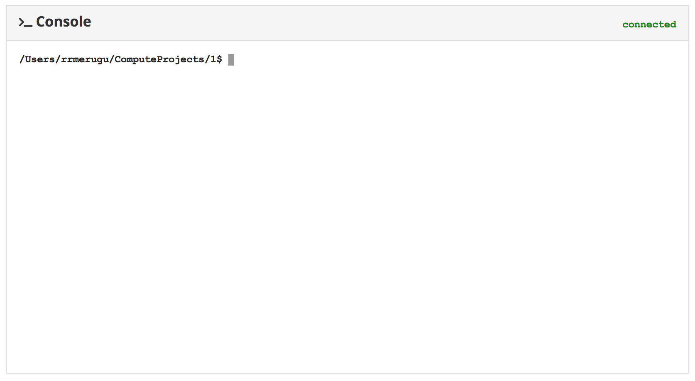

# Web-Console


Web-Console is a very lightweight terminal server that provides remote CLI via standard web browser and HTTP protocol. It works on all operating systems supported by Node.js, it doesn't depend
on native modules. Fast and easy to install. Supports multiple sessions.

NOTE: It is not a TTY emulator.




## Prerequisites
Node.js v0.10 or newer.


## Usage Examples

```javascript

    var http        = require("http"),
        terminal    = require("web-console");

    var app = http.createServer(function (req, res) {
        res.writeHead(200, {"Content-Type": "text/plain"});
        res.end("Hello World\n");
    });

    app.listen(1337);
    console.log("Server running at http://127.0.0.1:1337/");

    terminal(app);
    console.log("Web-terminal accessible at http://127.0.0.1:1337/console");

```


```javascript


```


Start the above application, then open your favorite browser and navigate to: http://localhost:8088/console


## Credits

This project is forked and inspired from https://github.com/rabchev/web-terminal

## License

(MIT License)

Copyright (c) 2017 Ravi Raja Merugu<rrmerugu@gmail.com>. All rights reserved.

Permission is hereby granted, free of charge, to any person obtaining
a copy of this software and associated documentation files (the
'Software'), to deal in the Software without restriction, including
without limitation the rights to use, copy, modify, merge, publish,
distribute, sublicense, and/or sell copies of the Software, and to
permit persons to whom the Software is furnished to do so, subject to
the following conditions:

The above copyright notice and this permission notice shall be
included in all copies or substantial portions of the Software.

THE SOFTWARE IS PROVIDED 'AS IS', WITHOUT WARRANTY OF ANY KIND,
EXPRESS OR IMPLIED, INCLUDING BUT NOT LIMITED TO THE WARRANTIES OF
MERCHANTABILITY, FITNESS FOR A PARTICULAR PURPOSE AND NONINFRINGEMENT.
IN NO EVENT SHALL THE AUTHORS OR COPYRIGHT HOLDERS BE LIABLE FOR ANY
CLAIM, DAMAGES OR OTHER LIABILITY, WHETHER IN AN ACTION OF CONTRACT,
TORT OR OTHERWISE, ARISING FROM, OUT OF OR IN CONNECTION WITH THE
SOFTWARE OR THE USE OR OTHER DEALINGS IN THE SOFTWARE.
